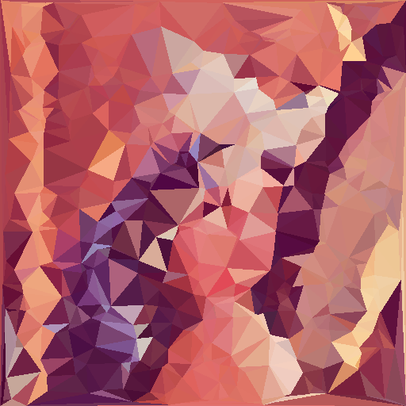
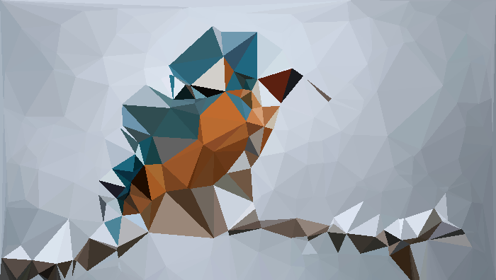
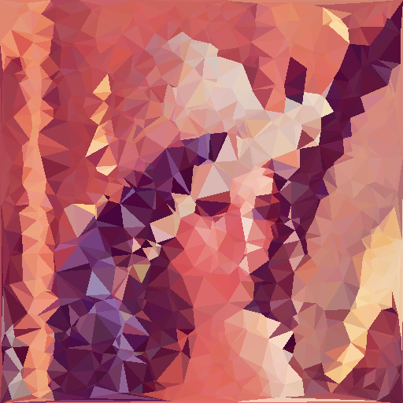
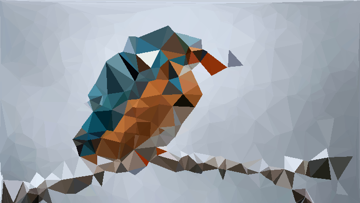
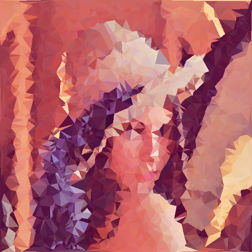
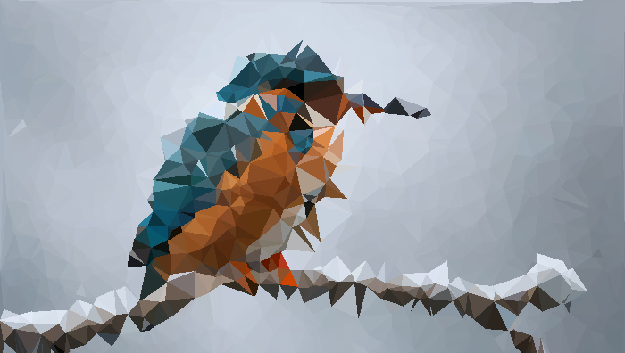
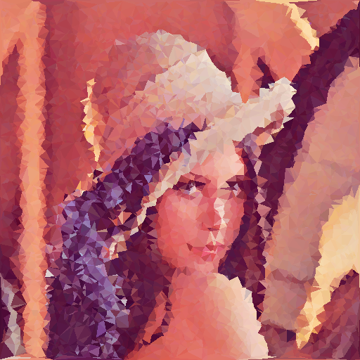
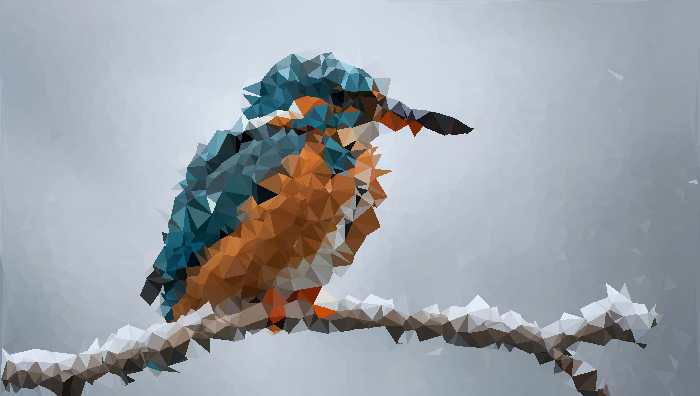
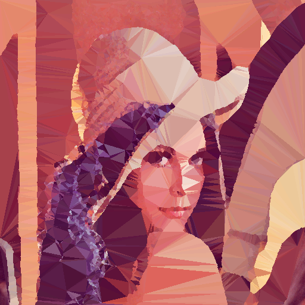
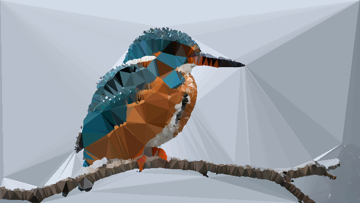

# Delaunay分割によるポリゴンアート

## 概要
画像からDelaunay分割によるポリゴンアートを生成するプログラム

## `delaunay_randam.py`
### 処理手順
1. 画像の読み込み
2. 画像内n個のランダムな点を生成
3. 生成した点からDelaunay分割
4. 分割領域内の重心値の色を取得
5. 重心値の色を分割領域内の全ての点に適用

### 実行結果
- 入力画像

    
    

- 出力画像 (n=500)

    
    

- 出力画像 (n=1000)

    
    

- 出力画像 (n=2000)

    
    

- 出力画像 (n=5000)

    
    

## `delaunay_contour.py`
`delaunay_randam.py`での処理は、記事[^1]を参考に実装した。

ある程度`n`を自動で設定できる方法を模索し、画像内の輪郭上から点を取得することで、色の変化の激しい部分に多くの点を配置することができると考えた。

### 処理手順
1. 画像の読み込み
2. 画像の輪郭を取得 (グレースケール化 -> 2値化 -> 輪郭抽出)
3. 輪郭上の点を取得
4. 取得した点からDelaunay分割
5. 分割領域内の重心値の色を取得

### 実行結果
- 入力画像

    
    

- 出力画像

    
    

より輪郭が綺麗に、背景の分割が少なく、細かな模様部分の分割が多くなり、ポリゴンにメリハリがついた。

[^1]: https://qiita.com/micky_dtl/items/b426a26a9e94a8e5fb4c